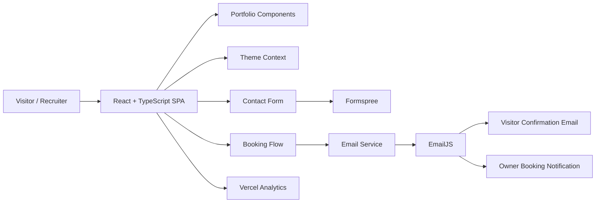

# Pitso Nkotolane — Software Developer Portfolio

A production-oriented personal portfolio built with **React, TypeScript, Vite, and Tailwind CSS**. The site presents software engineering experience, technical skills, projects, certifications, contact options, and a recruiter-friendly booking flow.

**Live site:** [pitsoporfolio.co.za](https://pitsoporfolio.co.za)  
**GitHub:** [github.com/Pitso4859](https://github.com/Pitso4859)  
**LinkedIn:** [linkedin.com/in/nkotolanepitso](https://www.linkedin.com/in/nkotolanepitso)

---

## Overview

This project is designed as a professional developer portfolio rather than a static résumé page. It combines portfolio content with practical interaction flows for recruiters, hiring managers, collaborators, and clients.

The application is a client-side React SPA deployed as a static Vite build. Contact submissions are handled by **Formspree**, booking notifications are sent through **EmailJS**, and production usage is measured with **Vercel Analytics**.

## Key Features

- Responsive portfolio interface for desktop, tablet, and mobile
- Light and dark themes with persisted user preference
- Professional hero, about, skills, projects, experience, and certification sections
- Downloadable CV
- Recruiter-focused contact form with inquiry categories
- Booking workflow for quick calls, meetings, and mentorship sessions
- Meeting duration, platform, date, time, and timezone selection
- User confirmation and administrator booking emails through EmailJS
- Formspree-powered contact submissions
- Lazy-loaded chatbot and analytics components
- Optimized WebP/image assets and split vendor bundles
- SEO metadata, sitemap, manifest, favicon, and custom-domain support
- Vercel deployment configuration

## Technology Stack

| Area | Technology |
| --- | --- |
| UI | React 19, TypeScript |
| Build tooling | Vite 8 |
| Styling | Tailwind CSS, custom CSS |
| Animation | Framer Motion |
| Icons/UI utilities | React Icons, Radix Hover Card, custom picture icons |
| Contact form | Formspree |
| Booking email delivery | EmailJS |
| Analytics | Vercel Analytics |
| Deployment | Vercel |
| Code quality | ESLint, TypeScript type checking |

## Architecture



The application has no custom backend or database. Form submissions and email delivery are delegated to managed external services.

For a deeper technical explanation, see [docs/ARCHITECTURE.md](docs/ARCHITECTURE.md).

## Project Structure

```text
.
├── public/
│   ├── Files/                  # CV and downloadable files
│   ├── icon-logo/              # Custom PNG icon assets
│   ├── images/                 # Portfolio/project images
│   ├── favicon.ico
│   ├── manifest.json
│   └── sitemap.xml
├── src/
│   ├── components/
│   │   ├── ui/                 # Reusable UI components
│   │   ├── About.tsx
│   │   ├── Booking.tsx
│   │   ├── Certificates.tsx
│   │   ├── Chatbot.tsx
│   │   ├── Contact.tsx
│   │   ├── Experience.tsx
│   │   ├── Footer.tsx
│   │   ├── Header.tsx
│   │   ├── Hero.tsx
│   │   ├── Projects.tsx
│   │   └── Skills.tsx
│   ├── contexts/
│   │   └── ThemeContext.tsx
│   ├── lib/                    # Shared utilities and scrolling/performance helpers
│   ├── services/
│   │   └── emailService.ts
│   ├── App.tsx
│   ├── main.tsx
│   └── index.css
├── docs/
├── index.html
├── package.json
├── tailwind.config.js
├── vite.config.ts
└── vercel.json
```

## Getting Started

### Prerequisites

Use a current Node.js LTS release compatible with Vite 8. Node.js **20.19+ or 22.12+** is recommended.

Verify your tools:

```bash
node --version
npm --version
```

### Installation

```bash
git clone https://github.com/Pitso4859/Nkotolane_Pitso-Portfolio.git
cd Nkotolane_Pitso-Portfolio
npm install
```

Create a local environment file:

```bash
cp .env.example .env.local
```

On Windows PowerShell:

```powershell
Copy-Item .env.example .env.local
```

Populate the EmailJS values in `.env.local`, then start the development server:

```bash
npm run dev
```

Vite will print the local URL in the terminal, normally `http://localhost:5173`.

## Environment Variables

The booking feature expects these Vite environment variables:

```env
VITE_EMAILJS_PUBLIC_KEY=
VITE_EMAILJS_SERVICE_ID=
VITE_EMAILJS_BOOKING_TEMPLATE=
VITE_EMAILJS_ADMIN_TEMPLATE=
```

> Important: any variable prefixed with `VITE_` is exposed to the browser bundle. Do not place private server secrets, passwords, private API keys, or confidential tokens in these variables.

See [docs/INTEGRATIONS.md](docs/INTEGRATIONS.md) for the required EmailJS template fields.

## Available Scripts

| Command | Purpose |
| --- | --- |
| `npm run dev` | Start the local Vite development server |
| `npm run build` | Create the production build in `dist/` |
| `npm run preview` | Preview the production build locally |
| `npm run type-check` | Run TypeScript validation without emitting files |
| `npm run lint` | Run ESLint with zero warnings allowed |
| `npm run build:prod` | Build with production environment mode |
| `npm run build:analyze` | Build with analysis mode enabled |
| `npm run optimize` | Pre-bundle dependencies with Vite |
| `npm run clean` | Remove build/dependency caches |

## Contact Form

The Contact section posts directly to Formspree and submits:

- `name`
- `email`
- `inquiry_type`
- `message`
- a subject field used for the portfolio contact notification

The current inquiry types include job opportunities, project collaboration, freelance work, technical questions, and other enquiries.

## Booking Flow

The Booking section supports:

- **Quick Call:** 15 or 30 minutes
- **Meeting:** 30 or 60 minutes
- **Mentorship:** 60 minutes
- Google Meet or Microsoft Teams
- Calendar date selection
- Fixed available time slots
- Timezone selection
- Name, email, and optional message capture
- Confirmation email to the visitor
- Booking notification email to the portfolio owner

### Current architectural limitation

The booking calendar is client-side and does **not** currently query a live calendar provider or reserve a slot in a database. The selected timezone is included with the booking data, but availability is not synchronized with Google Calendar or Microsoft Outlook. For production scheduling at scale, integrate a server-side calendar API or a scheduling provider.

## Performance Strategy

The portfolio includes several performance-oriented decisions:

- Lazy loading for the chatbot
- Lazy loading for Vercel Analytics
- Dynamic import of EmailJS only when a booking is submitted
- WebP image assets
- Manual vendor chunk splitting for React, Framer Motion, and React Icons
- Terser minification
- Disabled production source maps
- Deferred development-only checks

See [docs/ARCHITECTURE.md](docs/ARCHITECTURE.md) for more detail.

## Production Quality Checks

Run these commands before every deployment:

```bash
npm run type-check
npm run lint
npm run build
```

Also verify that no Git conflict markers were accidentally committed:

```bash
git grep -n -E '^(<<<<<<<|=======|>>>>>>>)'
```

A clean repository should return no matches.

## Deployment

The repository includes `vercel.json` configured for Vite:

```json
{
  "buildCommand": "npm run build",
  "outputDirectory": "dist",
  "framework": "vite",
  "installCommand": "npm install"
}
```

Deployment instructions and environment-variable setup are documented in [docs/DEPLOYMENT.md](docs/DEPLOYMENT.md).

## Engineering Documentation

- [Architecture](docs/ARCHITECTURE.md)
- [Development Guide](docs/DEVELOPMENT.md)
- [Deployment Guide](docs/DEPLOYMENT.md)
- [External Integrations](docs/INTEGRATIONS.md)
- [Security Notes](docs/SECURITY.md)
- [Troubleshooting](docs/TROUBLESHOOTING.md)
- [Contributing Guide](CONTRIBUTING.md)

## Testing Status

The current project includes TypeScript and ESLint quality checks but does not contain an automated unit, integration, or end-to-end test suite.

Recommended additions:

- **Vitest** for unit tests
- **React Testing Library** for component behavior
- **Playwright** for critical user flows
- Automated CI checks for lint, type checking, and production builds

## Contact

**Pitso Nkotolane**  
Software Developer — Johannesburg, South Africa

- Email: [pnkotolane@gmail.com](mailto:pnkotolane@gmail.com)
- LinkedIn: [linkedin.com/in/nkotolanepitso](https://www.linkedin.com/in/nkotolanepitso)
- GitHub: [github.com/Pitso4859](https://github.com/Pitso4859)
- Portfolio: [pitsoporfolio.co.za](https://pitsoporfolio.co.za)

## License

No open-source license file is currently included in this repository. Unless a license is added, the source code and portfolio content should be treated as **all rights reserved** by the repository owner.
