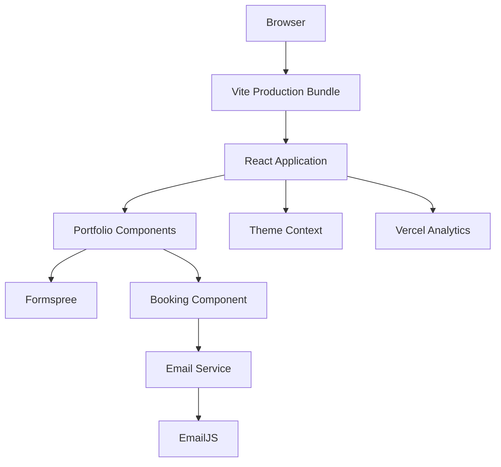
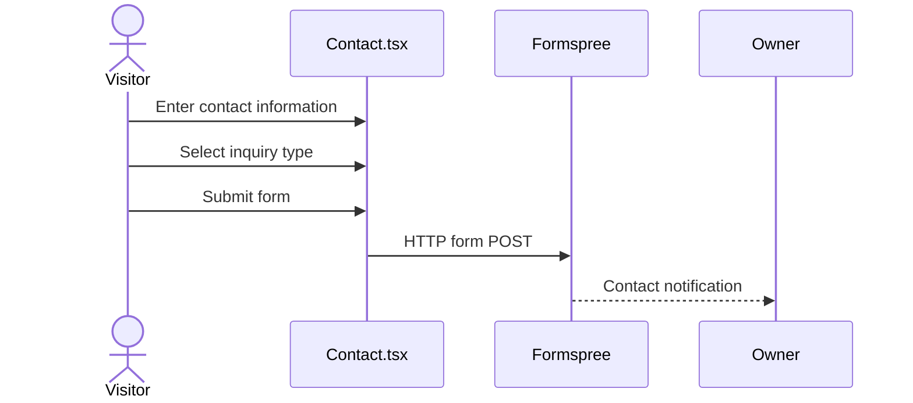
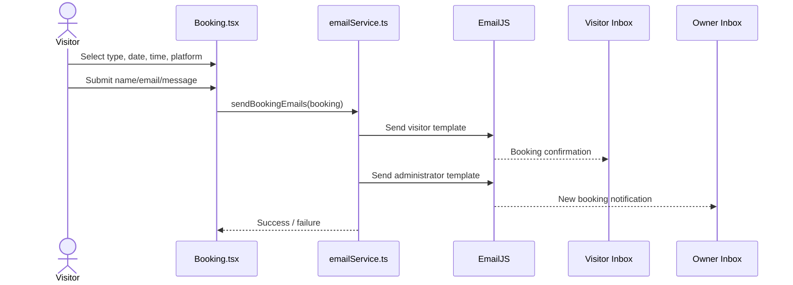

# Architecture

## 1. Purpose

This document describes the technical architecture of the Pitso Nkotolane Software Developer Portfolio.

The project is a browser-based React single-page application (SPA) intended to present professional information and support two conversion flows:

1. recruiter/client contact submissions;
2. direct booking requests.

The application deliberately avoids a custom backend. Managed external services are used for contact submission, email delivery, analytics, and deployment.

---

## 2. High-Level System Design



### Runtime model

The production output is static HTML, CSS, JavaScript, and image assets. Vercel serves the generated `dist/` directory. Business integrations are invoked directly from the browser.

---

## 3. Application Composition

`src/App.tsx` is the application composition root. It renders the main portfolio sections in this order:

1. Header
2. Hero
3. About
4. Skills
5. Soft Skills
6. Projects
7. Experience
8. Certificates
9. Contact
10. Booking
11. Footer

The Chatbot and Vercel Analytics are loaded using `React.lazy` and `Suspense` because they are non-critical to the initial page render.

---

## 4. Component Responsibilities

| Component | Responsibility |
| --- | --- |
| `Header.tsx` | Navigation, theme controls, primary booking CTA |
| `Hero.tsx` | Primary personal branding and high-priority actions |
| `About.tsx` | Professional summary, education/location information |
| `Skills.tsx` | Technical skill presentation |
| `SoftSkills.tsx` | Engineering and collaboration qualities |
| `Projects.tsx` | Portfolio project catalogue |
| `Experience.tsx` | Experience and education timeline |
| `Certificates.tsx` | Professional certifications |
| `Contact.tsx` | Direct contact information and Formspree form |
| `Booking.tsx` | Meeting selection and booking form |
| `Footer.tsx` | Contact, navigation, and social references |
| `Chatbot.tsx` | Deferred interactive assistant functionality |
| `PictureIcon.tsx` | Reusable image-based icon rendering |
| `PrimaryButton.tsx` | Shared primary call-to-action presentation |

---

## 5. State Management

The project intentionally uses local React state and context rather than a global state library.

### Theme state

`ThemeContext` stores either `light` or `dark` and persists the selected theme to `localStorage`. On first load, the application checks:

1. saved theme preference;
2. system `prefers-color-scheme` preference.

It also listens for operating-system theme changes.

### Booking state

`Booking.tsx` manages the booking workflow with local `useState` values for:

- booking type;
- duration;
- platform;
- selected date;
- selected time;
- current calendar month;
- selected timezone;
- form visibility;
- submission state;
- success/error feedback.

This state is ephemeral and is not persisted to a database or local storage.

---

## 6. Contact Data Flow



The contact form is serverless from the application's perspective. Formspree owns the submission endpoint and notification workflow.

---

## 7. Booking Data Flow



### Important limitation

Email delivery is not equivalent to calendar reservation. The current architecture does not:

- check owner availability against a live calendar;
- lock a slot against concurrent users;
- store booking records in a database;
- automatically create a Google Calendar or Outlook event.

For a future production scheduling system, introduce a backend/API layer and calendar-provider integration.

---

## 8. Performance Design

The Vite configuration applies production-focused build decisions:

- Terser minification
- no source maps in production
- manual vendor chunks for React, Framer Motion, and React Icons
- dependency pre-bundling

Runtime optimizations include:

- lazy-loaded Chatbot;
- lazy-loaded Vercel Analytics;
- dynamic EmailJS import only on booking submission;
- optimized image assets;
- development-only diagnostic checks.

---

## 9. Static Assets

Public assets are served from `public/` and referenced using root-relative URLs.

Examples:

```text
/icon-logo/location_logo.png
/images/profile.webp
/Files/NKOTOLANE PITSO GINTOS RESUME.pdf
```

This approach works with the Vite `base: '/'` configuration and the current root-domain deployment.

---

## 10. Reliability and Error Handling

Booking submission validates:

- required name;
- required email;
- email format;
- selected date/time.

Email failures produce an error state and direct the visitor to contact the owner by email.

Because the project relies on external SaaS integrations, availability of Formspree, EmailJS, and Vercel affects specific features independently.

---

## 11. Recommended Evolution

For a stronger production architecture, consider:

1. adding a serverless API for bookings;
2. storing booking records in a managed database;
3. implementing rate limiting and abuse controls;
4. integrating Google Calendar or Microsoft Graph for real availability;
5. adding server-side email delivery;
6. introducing automated tests and CI;
7. adding observability for form and booking failures.
